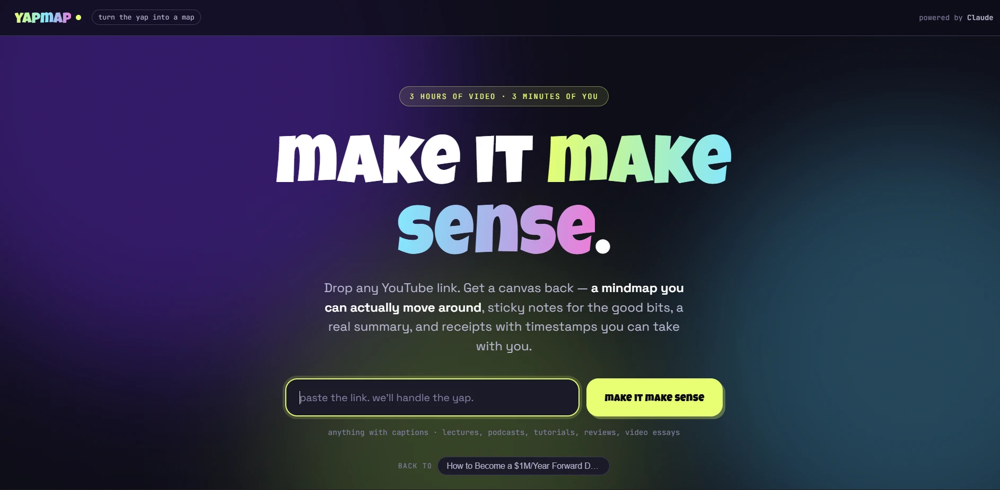
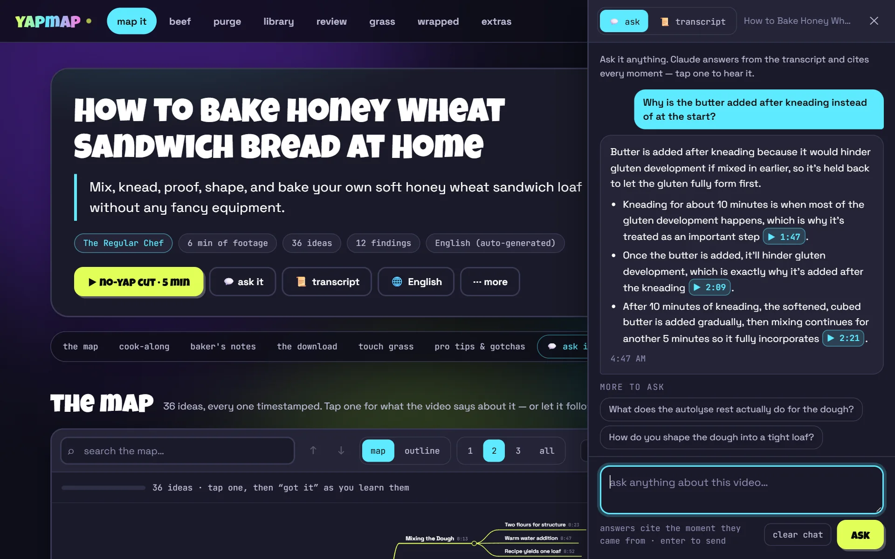
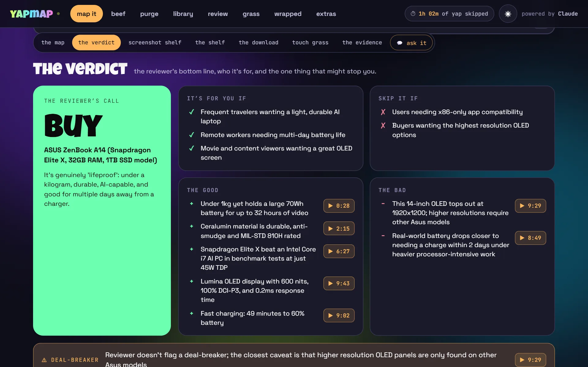
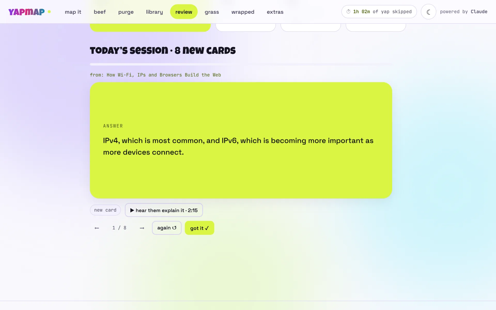

# yapmap

**Turn the yap into a map.** Paste a YouTube link and watch a canvas build itself live: a mindmap where **every idea is timestamped and explained**, a tool built for that kind of video, answers to anything you ask it, sticky notes for the good bits, a summary in any voice you like, and a **no-yap cut** — the real video, with everything between the good parts cut out.

Runs on your own machine. Uses your **Claude subscription** through the Claude Code CLI, so there's **no API key and no per-token billing**.

**[Try the live demo →](https://neilk2162.github.io/yapmap/)** Real canvases for five Creative Commons videos, one of each kind. No install, nothing to sign into.



---

## Don't skip the video. Skip the yap.

Summarisers try to replace the video: read this, so you don't have to watch. yapmap goes the other way. It makes the video itself navigable — before you watch, while you watch, and after — and every single thing it produces is a doorway back to the exact second it came from.

## The map

Most AI mind maps are a picture of headings. yapmap's is a study tool.

- **Every idea is a moment.** Each node carries a timestamp. Tap it, and the inspector opens with what the video actually says about that idea, the transcript lines at that moment, and a button that plays it.
- **Ideas, not a table of contents.** Themes gather related points from wherever they come up in the video. A "staying secure" branch can pull moments from minute 6, minute 8 and minute 12.
- **It follows the video.** Turn on *follow the video* and whatever idea is being discussed lights up and stays in view as it plays.
- **It grows while you watch.** The map streams in node by node as Claude writes it. You can start exploring before it's finished.
- **Ask about any idea.** One tap sends it to *ask it*, which answers from the transcript and cites its sources.
- **Track what you've got.** Mark ideas (or whole branches) as got. The map keeps your progress, per video.
- **Find and focus.** Search every label and note, jump between matches, fold to 1, 2 or 3 levels, or narrow the map to one branch.
- **Keyboard-driven.** Arrow keys move between ideas, Enter plays, Space folds, G marks as got, F focuses. There's also an **outline view** that reads like notes.
- **Take it anywhere.** Export as PNG, SVG, a Markdown outline with deep links, or **OPML** for XMind, MindNode, Obsidian and Logseq.

## The canvas

One link in:

| | |
|---|---|
| **▶ the no-yap cut** | The moments that matter, played back to back in the real YouTube player — *"13 min → 6 min"*. It goes through YouTube's own player, so the creator still gets the view. |
| **the map** | Everything above. |
| **the tool** | Something built for *this kind* of video — flashcards, a cook-along, a buy/skip card, claims to check, or a timeline. See below. |
| **💬 ask it** | Ask the video anything. Answers stream in and cite the second each claim came from; tap a citation to hear it. Every canvas comes with a few questions worth asking. |
| **📜 transcript** | The whole transcript, searchable, highlighting along as the video plays. |
| **the wall** | Sticky notes for the lines worth screenshotting. Drag them around, or turn one into a 1080×1920 story card in a tap. |
| **the shelf** | Every book, tool, person and paper the video name-drops, with the second they said it and a link to look it up. |
| **the download** | A real summary — straight, or re-voiced as a group chat, a sports commentator, full brainrot, or like-I'm-five. |
| **touch grass protocol** | Concrete things to go and do. Pin one, put it in your calendar (Google, Apple or Outlook), and yapmap asks you later whether you actually did it. |
| **receipts** | The key findings. Tick the ones that matter and export them as Markdown. |

While a new canvas cooks you can **call it**: guess the big idea, and the TL;DR stays blurred until you do. Guessing before you learn — even guessing wrong — improves what you remember; learning research calls it the pretesting effect.

The ⋯ menu prints a **study sheet** (or saves it as a PDF), downloads the whole canvas as Markdown, regenerates, or deletes it. What you tick, fold and mark is remembered per video.

### A tool for every kind of video

Claude first works out what kind of video it is, then builds the tool to match — and names every section itself.

| Mode | Fits | The tool |
|---|---|---|
| `study` | lectures, tutorials, explainers | **cram deck** — flashcards whose answer side plays the creator explaining it, on a spaced-repetition schedule. Exports to Anki. |
| `howto` | recipes, builds, walkthroughs | **cook-along** — a pantry checklist that becomes your shopping list, step timers, and a hands-free mode. The no-yap cut plays each step being done. |
| `verdict` | reviews, comparisons, buying guides | **buy/skip card** — the reviewer's call, who it's for, who should skip, and the deal-breaker. |
| `yap` | podcasts, interviews, commentary | **claims to check** — every checkable claim, who made it, how to verify it, and a place to mark what holds up. |
| `story` | documentaries, video essays, news | **timeline** — scrub it to jump, and it follows the video as it plays. |

Real examples: a bread recipe came back as **Bread Baking 101** with **Pro Tips & Gotchas**; a laptop review as a **Featherweight Flex** with **The Evidence**; a science podcast as an **Ethics Deep-Dive**, with every claim attributed to the guest who made it.

## The toolkit

Everything else lives in the tabs along the top.

| Tab | What it does |
|---|---|
| **beef** | Two videos, one ring. Where they genuinely clash — each side's receipt, playable — where they agree, and what only one of them covers. |
| **purge** | Paste up to 12 links, or a playlist. Get *watch / skim / skip* for each, the best moment, and the hours you'd save. |
| **library** | Every canvas you've ever made: search them all at once (every result plays its moment), sort, filter by kind, delete. |
| **review** | Every cram deck on one schedule. A card comes back right before you'd forget it, and further out each time you know it. The tab shows how many are due. |
| **grass** | Your commitments and your follow-through streak — a streak for things you *did*, not things you watched. |
| **wrapped** | Your month: yap skipped, cards reviewed, questions asked, what kind of watcher you were, the line that hit hardest. Downloads as a story. |
| **extras** | The one-click "map this" bookmark, the language Claude writes in, theme, keyboard shortcuts, and where your data lives. |

Long jobs keep going if you leave the page — the nav shows what's cooking and tells you when it's ready. Light and dark mode are both first-class.

### Any language

Canvases, answers, beefs and purges can be written in **English, Hinglish, हिन्दी, Español, Português, Français, Deutsch, 日本語, 한국어, Bahasa Indonesia**, or whatever language the video is in. Set a default in *extras*, or remake any canvas in another language from its 🌐 menu. The video itself can be in any language that has captions.

### See it

**The canvas.** The video comes back retitled, with a one-line TL;DR, its channel and runtime, the no-yap cut, and the language it's written in.


**The map.** Every idea with its timestamp. Tap one, and the inspector shows what the video says about it, the lines where it's said, and a button that plays that moment.


**Ask it.** Answers come from the transcript, and every claim cites its moment. Tap a citation to hear it.



**The tool.** A laptop review gets a buy/skip card: the reviewer's call, who it's for and who should skip it, the good and the bad with timestamps, and the deal-breaker.



**The wall.** The lines worth screenshotting, each tagged by kind and linked to its timestamp.


**The download.** A real summary. Read it straight, or re-voice it as a group chat, a sports commentator, brainrot, or like-I'm-five.


**Touch grass and the findings.** What to go and do, then the key findings to tick and export.


**Review**, here in light mode. Each card comes back right before you'd forget it, and *hear them explain it* plays the moment its answer came from.



---

## Setup

You need **Python 3.10+**, **Node 18+**, and a **Claude subscription** (Pro or Max).

**1. Install the Claude Code CLI and sign in**

```bash
npm install -g @anthropic-ai/claude-code
```

```bash
claude auth login
```

That opens a browser — sign in with the account your subscription is on. Then confirm:

```bash
claude auth status
```

You want to see `"loggedIn": true` and your `subscriptionType`. If you have an `ANTHROPIC_API_KEY` set in that shell from another project, **unset it** — it takes priority over the subscription login and will bill you per token.

**2. Install the Python dependencies**

```bash
pip install -r requirements.txt
```

**3. Run it**

```bash
python app.py
```

Open **http://localhost:5000**, paste a link, hit *make it make sense*.

The canvas starts filling in within about ten seconds and is done in about a minute. After that it's cached locally, so reopening it is instant — and so is everything in the library. Asking a question takes a few seconds.

**Optional: the one-click button.** Open the *extras* tab and drag *🗺️ map this* to your bookmarks bar. On any YouTube video, click it and the video opens straight in yapmap.

---

## Config

All optional, all environment variables:

| Variable | Default | Does what |
|---|---|---|
| `CLAUDE_MODEL` | `sonnet` | Swap the model: `opus`, `haiku`, or a full model name |
| `CLAUDE_THINKING` | `off` | `auto` lets Claude think before it writes. In testing that made a canvas four times slower and cost far more of your usage limit |
| `CLAUDE_BIN` | `claude` | Full path to the CLI if it isn't on `PATH` |
| `CLAUDE_TIMEOUT_SECONDS` | `600` | Raise it for very long videos, or big beefs |
| `YAPMAP_CACHE_DIR` | `.cache` | Where canvases, transcripts, answers, beefs, purges and voices are cached |
| `YAPMAP_DATA_DIR` | `.yapmap` | Your commitments, flashcard reviews and Wrapped activity — kept apart, so clearing the cache never wipes them |
| `PORT` | `5000` | Port to serve on |

Want more or less detail in the output? It's all one prompt — `build_canvas_prompt()` in [`app.py`](app.py). Change the rules, bump `CANVAS_PROMPT_VERSION`, and regenerate.

---

## Fonts

Four faces, no setup required:

| Face | Where | How it loads |
|---|---|---|
| **Luckiest Guy** | wordmark, hero, section titles, headlines | self-hosted from `static/fonts/`, bundled in this repo |
| **Space Grotesk** | body copy, the map, summaries | Google Fonts |
| **JetBrains Mono** | timestamps, pills, small caps chrome | Google Fonts |
| **Noto Sans Devanagari** | Hindi text | Google Fonts — only downloaded when a page has Hindi on it |

Luckiest Guy is by Brian J. Bonislawsky (Astigmatic) and is licensed under the **Apache License 2.0**, which permits redistribution — so it ships with the repo and its licence sits beside it at [`static/fonts/LuckiestGuy-LICENSE.txt`](static/fonts/LuckiestGuy-LICENSE.txt). Self-hosting means the display layer works offline and never flashes an unstyled headline.

It only covers Latin, so arrows and ticks (`↓ ▶ ✓ ✦`) fall back per glyph, which is intended. If the file ever goes missing the whole display layer falls back to Space Grotesk and the page still looks right.

**Swapping it out:** drop a new file in `static/fonts/`, update the `@font-face` block at the top of [`static/css/app.css`](static/css/app.css), and check the new font's licence first — a public repo redistributes everything committed to it, and most display fonts are not licensed for that.

---

## Troubleshooting

**`[WinError 2] The system cannot find the file specified`**
Python couldn't launch the CLI. On Windows `npm install -g` creates a `claude.cmd` shim, and `CreateProcess` only tries appending `.exe` — so the bare name `claude` doesn't resolve even though it works fine in your shell. `app.py` handles this by resolving the full path with `shutil.which()` first. If it comes back, check that `where claude` finds it, or set `CLAUDE_BIN` to the full path of `claude.cmd`.

**`Couldn't find the Claude Code CLI on your PATH`**
`where claude` / `which claude` returns nothing. Reinstall it, or set `CLAUDE_BIN`.

**"You've hit your Claude usage limit for now"**
Your subscription's usage window is used up. Everything you've already mapped still opens, searches and plays — new canvases and answers work again once it resets. A canvas warns you when you're close.

**"YouTube is blocking transcript requests from your connection"**
YouTube rate-limits transcript downloads. After a burst of them (a big purge, say), or on a VPN or cloud network, it turns requests away for a while, usually 15 minutes to an hour. Wait, then try again. Transcripts are cached once fetched, so regenerating and asking about videos you've already mapped doesn't count against the limit.

**New features fail after updating**
The page updated, but an older `python app.py` is still running the old server code. Stop it (Ctrl+C) and start it again.

**"Captions are switched off for this video"**
yapmap reads transcripts, not audio. No captions, no canvas — there's no way around that short of running speech-to-text yourself.

**It asks about billing or an API key**
Run `claude auth status`. If it shows an API-key setup rather than your subscription, run `claude auth login` and unset `ANTHROPIC_API_KEY` in that shell.

**The mindmap area is blank**
It loads d3 and markmap from a CDN. Check your connection and refresh — the outline view and the rest of the canvas work without them.

**A timestamp opens YouTube in a new tab instead of playing in the page**
That creator has switched off embedding, or YouTube's player script was blocked (an ad blocker can do it). yapmap falls back to opening the moment on YouTube.

**The purge says a playlist needs yt-dlp**
It's in `requirements.txt`, so `pip install -r requirements.txt` again. Or skip it and paste the video links one per line.

---

## How it works

```
YouTube link
   └─ youtube-transcript-api  →  timestamped transcript blocks (cached)
        └─ claude -p (stdin, stream-json)  →  one JSON canvas, streamed token by token
             └─ Flask job  →  server-sent events  →  the page fills in section by section
```

No build step and no framework. The frontend is plain ES modules in [`static/js/`](static/js/) — one per tool under `views/` — with hash routing, so the exact same files run under Flask and as the static demo.

**Timestamps.** The transcript is chunked into ~220-character blocks, each starting with the moment it was spoken at. Claude copies those stamps character for character, and the server converts them to seconds. When the model did that arithmetic itself, it sometimes dropped the minutes. Now it only copies: in testing, 443 of 473 timestamps landed exactly on a transcript line, and none was more than ten seconds out.

**Streaming.** The CLI runs with `--output-format stream-json --include-partial-messages`. A small incremental parser hands each top-level field of the JSON to the page the moment it closes, and repairs the half-written mindmap into valid JSON so it can grow on screen. Each generation is a server-side job: the page can leave and come back (events replay from where it was), several tabs can watch the same job, and cancelling kills the CLI's whole process tree.

**Asking.** Short videos send Claude the whole transcript with your question. For long ones, a BM25 search picks the passages that best match it, so one question never costs a whole long video's worth of usage. Answers must cite `[M:SS]` for every claim, and the page turns those into buttons.

**Reviewing.** Flashcards follow a Leitner schedule — 1, 3, 7, 16, 35, then 90 days. Knowing a card moves it further out; missing it starts it over.

The prompt goes to the CLI over **stdin**, never as a command-line argument — on Windows the `.cmd` shim routes the command line through `cmd.exe`, which truncates it at the first newline and would read quotes, `&` and `%VAR%` in transcript text as shell syntax.

Responses are normalised before they reach the browser: a model that skips a field, or returns a string where a list belongs, degrades into a thinner canvas rather than a broken page. Canvases from an older version of the prompt still open — the page says what's missing and offers to regenerate.

### The demo gallery

[The live demo](https://neilk2162.github.io/yapmap/) is this same app with no server. It reads pre-built results from [`demo/`](demo/) instead — canvases, transcripts, a few answers — and everything works except making new ones. A [GitHub Actions workflow](.github/workflows/pages.yml) publishes it on every push to `main`.

`demo/` is written by [`export_demo.py`](export_demo.py) from an explicit allowlist, so nothing else in your cache can be published by accident. Every video in it is **Creative Commons Attribution (CC BY)** licensed on YouTube, and each demo canvas credits its creator and links to the original. To change what's in it, generate the canvases locally, edit the allowlist, then run:

```bash
python export_demo.py
```

---

## Notes and limits

- **Captions required.** Manual or auto-generated, any language.
- **Very long videos get trimmed.** Transcripts are capped at ~120k characters (a few hours of speech). Past that the canvas covers what fits, and says so on the page.
- **Subscription usage is a real budget.** Each canvas, beef or purge is one substantial Claude call; a question or a re-voice is a small one. Everything is cached on disk, and regenerating is always opt-in.
- **Your data stays put.** Canvases, transcripts and answers live in `.cache/`; commitments, reviews and Wrapped activity in `.yapmap/`. Both are gitignored. The only things that leave your machine are transcripts and your questions going to Claude, through the CLI you're signed into.
- **This is a local dev server.** Flask's built-in one, with `debug=True`. Fine on your own machine, not meant to be exposed to the internet as-is — anyone who can reach it can spend your Claude usage.
- **Not affiliated with YouTube or Anthropic.** It reads public transcripts and shells out to a CLI you're already logged into.

## License

MIT — see [LICENSE](LICENSE).

The bundled font is separate: **Luckiest Guy** is Apache 2.0, and its licence travels with it in [`static/fonts/`](static/fonts/).
