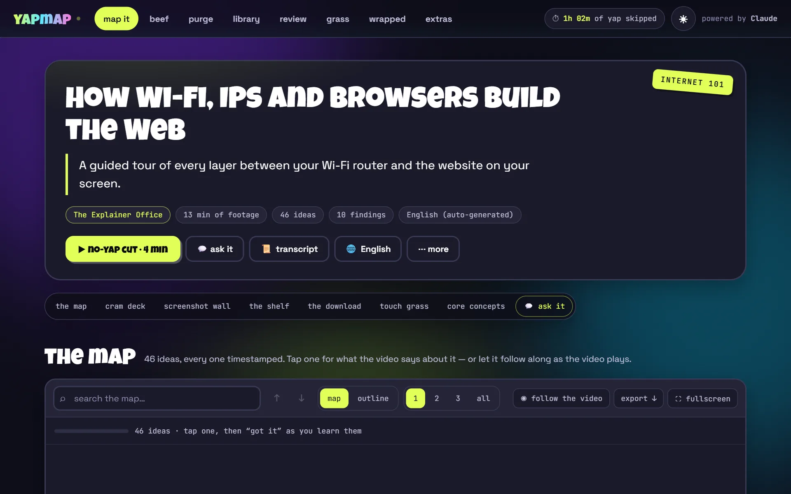
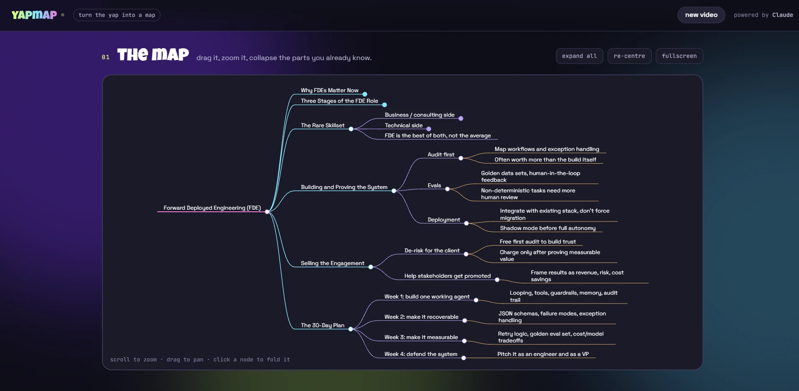
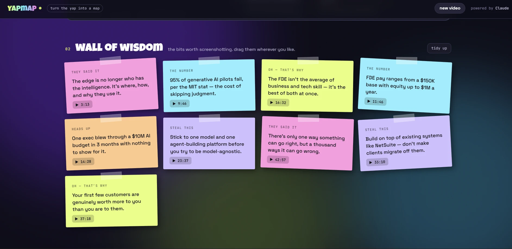
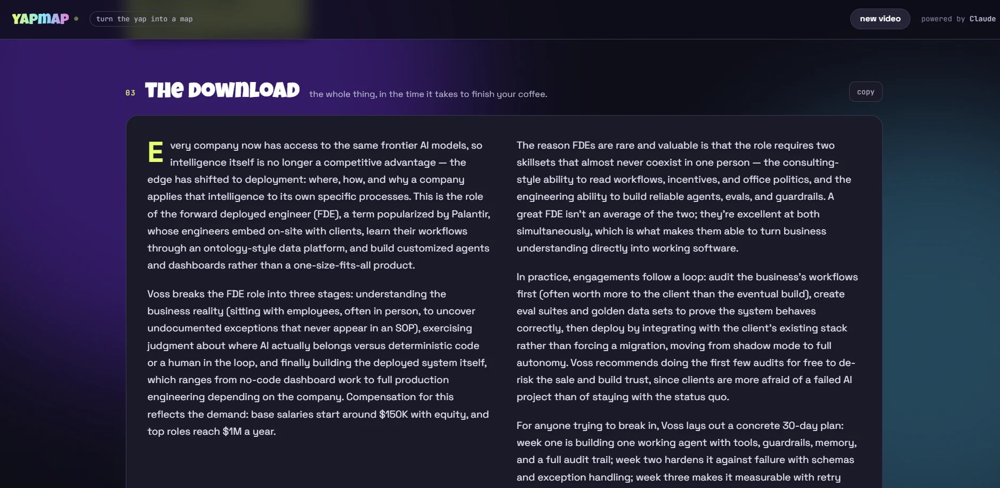
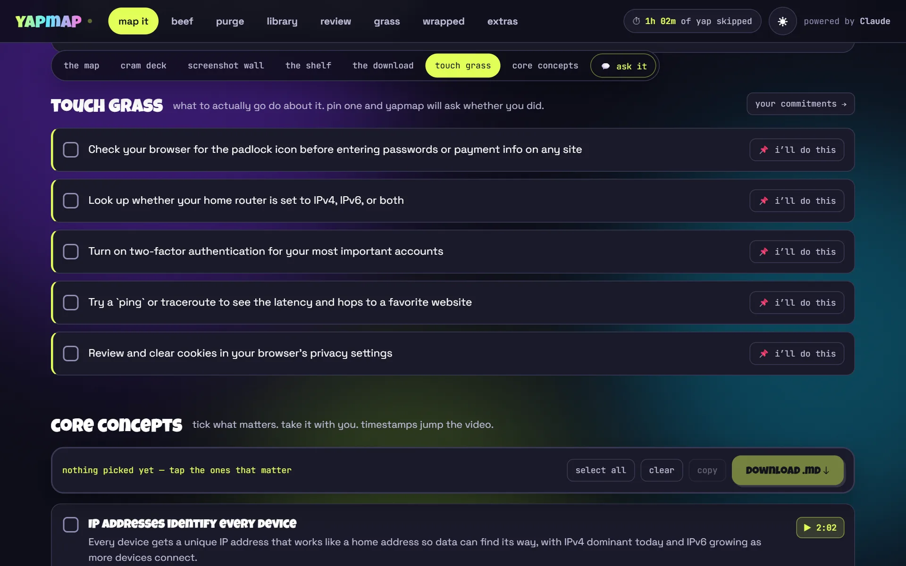

# yapmap

**Turn the yap into a map.** Paste a YouTube link, get a canvas back — an interactive mindmap, a wall of sticky notes, a real summary, and timestamped findings you can tick and download.

Runs on your own machine. Uses your **Claude subscription** through the Claude Code CLI, so there's **no API key and no per-token billing**.



---

## What you get

One link in, five artifacts out:

| | |
|---|---|
| **the map** | A pan/zoom/collapsible mindmap of the whole video. Drag it, fold the parts you already know, go fullscreen. |
| **the wall** | Sticky notes for the moments worth screenshotting — quotes, warnings, the numbers. Draggable. |
| **the download** | A proper multi-paragraph summary, not bullet soup. |
| **touch grass protocol** | 3–5 concrete things to actually go do offline afterwards. |
| **receipts** | The key findings, each with a timestamp. Tick the ones that matter and export them as Markdown. |

Every timestamp is clickable: it seeks an embedded player, and it survives into the exported Markdown as a deep link back to that exact second.

### See it

**The map** — the whole video as a tree. Fold what you already know, drag, zoom, go fullscreen.



**The wall** — the lines worth screenshotting, each tagged by kind and linked to its timestamp. Every note is draggable.



**The download** — a real summary, in paragraphs.



**Touch grass protocol and receipts** — what to go and do, then the findings you tick and export as Markdown.



### It adapts to the video

There's no single "summarise it" template. Claude first works out what kind of video it is, then builds artifacts to match — and names the sections itself:

| Mode | Fits | "Receipts" become |
|---|---|---|
| `study` | lectures, tutorials, explainers | the core concepts, each explained |
| `yap` | podcasts, interviews, commentary | the actual claims, and who made them |
| `howto` | recipes, builds, walkthroughs | the steps in order |
| `verdict` | reviews, comparisons, buying guides | the pros, cons, and the call |
| `story` | documentaries, video essays, news | the key events in sequence |

The labels change with every video. The career interview in the screenshots came back as a **Career Masterclass** with a **Wall of Wisdom**; a freeCodeCamp system-design lecture came back as a **System Design Bootcamp** with **Whiteboard Scraps**.

---

## Setup

You need **Python 3.10+**, **Node 18+**, and a **Claude subscription** (Pro or Max).

**1. Install the Claude Code CLI and sign in**

```bash
npm install -g @anthropic-ai/claude-code
```

```bash
claude auth login
```

That opens a browser — sign in with the account your subscription is on. Then confirm:

```bash
claude auth status
```

You want to see `"loggedIn": true` and your `subscriptionType`. If you have an `ANTHROPIC_API_KEY` set in that shell from another project, **unset it** — it takes priority over the subscription login and will bill you per token.

**2. Install the Python dependencies**

```bash
pip install -r requirements.txt
```

**3. Run it**

```bash
python app.py
```

Open **http://localhost:5000**, paste a link, hit *make it make sense*.

The first canvas takes roughly 40–90 seconds depending on video length. After that the video is cached locally, so reopening it is instant.

---

## Config

All optional, all environment variables:

| Variable | Default | Does what |
|---|---|---|
| `CLAUDE_MODEL` | `sonnet` | Swap the model: `opus`, `haiku`, or a full model name |
| `CLAUDE_BIN` | `claude` | Full path to the CLI if it isn't on `PATH` |
| `CLAUDE_TIMEOUT_SECONDS` | `420` | Raise it for very long videos |
| `YAPMAP_CACHE_DIR` | `.cache` | Where generated canvases are stored |
| `PORT` | `5000` | Port to serve on |

Want more or less detail in the output? It's all one prompt — `build_canvas_prompt()` in [`app.py`](app.py). Change the rules, delete the `.cache/` folder, regenerate.

---

## Fonts

Three faces, no setup required:

| Face | Where | How it loads |
|---|---|---|
| **Luckiest Guy** | wordmark, hero, section titles, headlines, buttons | self-hosted from `static/fonts/`, bundled in this repo |
| **Space Grotesk** | body copy, summaries, finding details | Google Fonts |
| **JetBrains Mono** | timestamps, pills, small caps chrome | Google Fonts |

Luckiest Guy is by Brian J. Bonislawsky (Astigmatic) and is licensed under the **Apache License 2.0**, which permits redistribution — so it ships with the repo and its licence sits beside it at [`static/fonts/LuckiestGuy-LICENSE.txt`](static/fonts/LuckiestGuy-LICENSE.txt). Self-hosting means the display layer works offline and never flashes an unstyled headline.

It only covers Latin, so arrows and ticks (`↓ ▶ ✓ ✦`) fall back per glyph, which is intended. If the file ever goes missing the whole display layer falls back to Space Grotesk and the page still looks right.

**Swapping it out:** drop a new file in `static/fonts/`, update the `@font-face` block at the top of [`templates/index.html`](templates/index.html), and check the new font's licence first — a public repo redistributes everything committed to it, and most display fonts are not licensed for that.

---

## Troubleshooting

**`[WinError 2] The system cannot find the file specified`**
Python couldn't launch the CLI. On Windows `npm install -g` creates a `claude.cmd` shim, and `CreateProcess` only tries appending `.exe` — so the bare name `claude` doesn't resolve even though it works fine in your shell. `app.py` handles this by resolving the full path with `shutil.which()` first. If it comes back, check that `where claude` finds it, or set `CLAUDE_BIN` to the full path of `claude.cmd`.

**`Couldn't find the Claude Code CLI on your PATH`**
`where claude` / `which claude` returns nothing. Reinstall it, or set `CLAUDE_BIN`.

**"Captions are switched off for this video"**
yapmap reads transcripts, not audio. No captions, no canvas — there's no way around that short of running speech-to-text yourself.

**It asks about billing or an API key**
Run `claude auth status`. If it shows an API-key setup rather than your subscription, run `claude auth login` and unset `ANTHROPIC_API_KEY` in that shell.

**The mindmap area is blank**
It loads d3 and markmap from a CDN. Check your connection and refresh — the rest of the canvas works without them.

---

## How it works

```
YouTube link
   └─ youtube-transcript-api  →  timestamped transcript blocks
        └─ claude -p (stdin)  →  one JSON canvas
             └─ Flask + markmap  →  the page you interact with
```

The transcript is chunked into ~220-character blocks, each tagged with the second it was spoken at. That's what lets Claude cite a moment rather than just paraphrase, and it's what makes every timestamp in the UI land in the right place.

The prompt goes to the CLI over **stdin**, never as a command-line argument — on Windows the `.cmd` shim routes the command line through `cmd.exe`, which truncates it at the first newline and would read quotes, `&` and `%VAR%` in transcript text as shell syntax.

Responses are normalised before they reach the browser: a model that skips a field, or returns a string where a list belongs, degrades into a thinner canvas rather than a broken page.

---

## Notes and limits

- **Captions required.** Manual or auto-generated, any language — non-English videos work, the canvas just comes back in that language's terms.
- **Very long videos get trimmed.** Transcripts are capped at ~120k characters (a few hours of speech). Past that the canvas covers what fits, and says so on the page.
- **Subscription usage is a real budget.** Each canvas is one substantial Claude call. That's why results are cached on disk — regenerating is opt-in, via the *regenerate* button.
- **This is a local dev server.** Flask's built-in one, with `debug=True`. Fine on your own machine, not meant to be exposed to the internet as-is.
- **Not affiliated with YouTube or Anthropic.** It reads public transcripts and shells out to a CLI you're already logged into.

## License

MIT — see [LICENSE](LICENSE).

The bundled font is separate: **Luckiest Guy** is Apache 2.0, and its licence travels with it in [`static/fonts/`](static/fonts/).
